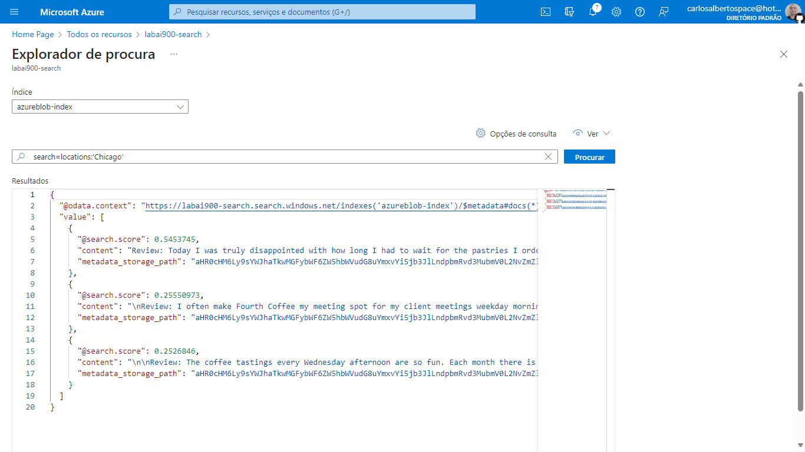
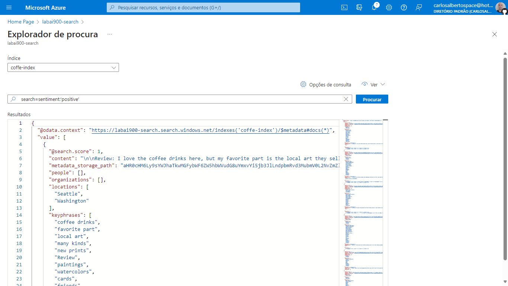

Segui os mesmos conceitos usado pelo casjunior93
By Arthur Moreira

# Azure Cognitive Search: Utilizando AI Search para consulta de Dados

Links importantes:

[Explore an Azure AI Search index (UI)](https://aka.ms/ai900-ai-search)

[Zip com os reviews](https://aka.ms/mslearn-coffee-reviews)

## Passo 1:

Primeiro precisei criar um recurso do Azure AI Search dentro do Azure AI Services. Em Escalão de preço, utilizei "Básico".

Depois criei o recurso de Serviços Cognitivos.

E após criei uma conta de armazenamento.

Para configurá-la com configurações básicas apenas para este laboratório, precisei liberar o acesso ao container de Blob para anônimos em Menu lateral na página do recurso > Configurações > Permitir acesso anônimo de Blob.

## Importando dados

Para importar os dados, acessei "Armazenamento de dados" > "Contentores" para trazer arquivos. Criei um novo container com o nome coffereview e o nível de acesso como "Contentor (Acesso a leitura anônima para contentores e blobs)".

Acessei o contentor que acabei de criar e cliquei no botão "Carregar". Então fiz o upload dos arquivos de texto disponíveis em https://aka.ms/mslearn-coffee-reviews.

Então acessei o recurso criado para o AI Search e "Importar dados".

Para importar os dados, segui o tópico "Indexar os documentos" deste artigo (https://microsoftlearning.github.io/mslearn-ai-fundamentals/Instructions/Labs/11-ai-search.html).

## Testando a pesquisa

Para fazer o teste, acessei a aba "Explorador de procura" da página do recurso de pesquisa.

Fiz uma pesquisa sobre localidade:

_search=locations:'Chicago'_

E outra pesquisa sobre opiniões positivas:

_search=sentiment:'positive'_

